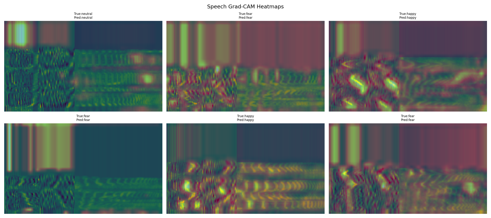
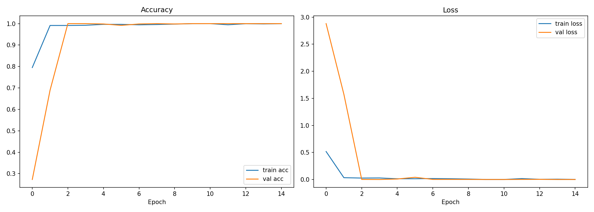
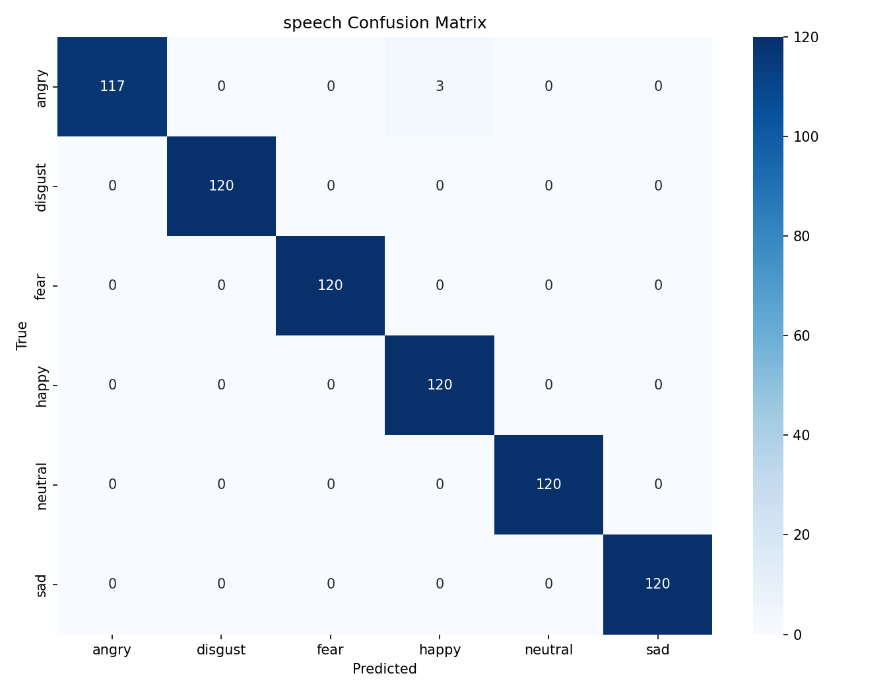
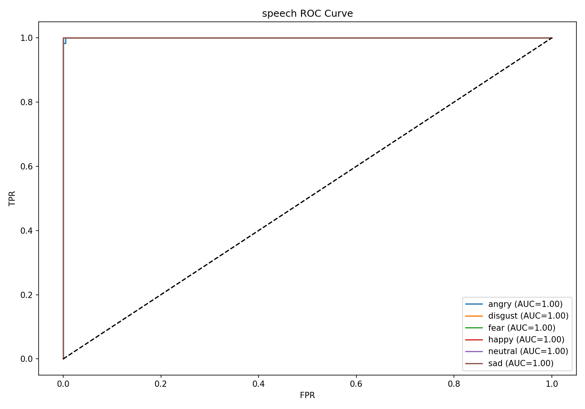
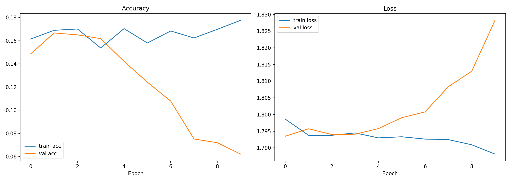
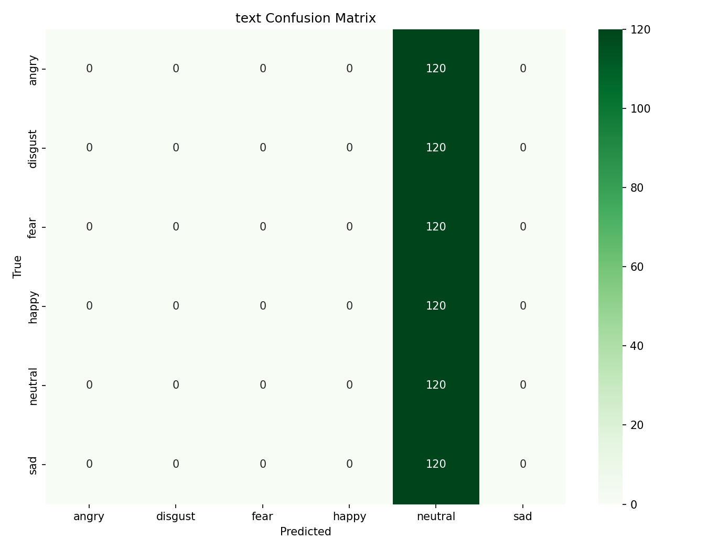
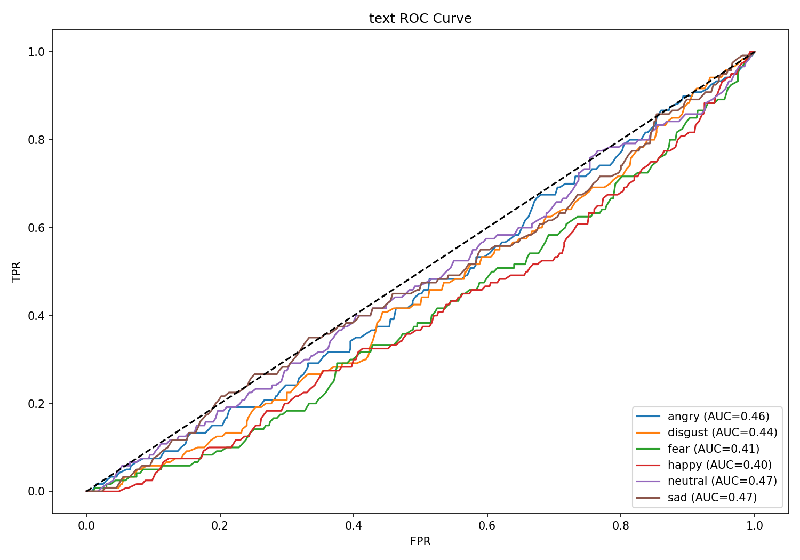

# 🎭 Multimodal Emotion Recognition using Speech and Text

<p align="center">
  
</p>

---

## 📌 Overview

This project presents a **Multimodal Emotion Recognition System** developed using the **TESS (Toronto Emotional Speech Set)** dataset. The system combines both **speech-based** and **text-based** emotional understanding to classify human emotions more effectively.

The project consists of three independent pipelines:

* 🎙️ Speech Emotion Recognition
* 📝 Text Emotion Recognition
* 🔀 Multimodal Fusion

The final system explores:

* Temporal acoustic modelling
* Transformer-based contextual embeddings
* Multimodal representation learning

---

# 🧠 System Architecture

## 🎙️ Speech Pipeline

The speech model uses:

* CNN layers for acoustic feature extraction
* BiLSTM layers for temporal modelling
* Attention mechanism for focusing on emotionally relevant regions

### Extracted Features

* MFCC
* Delta MFCC
* Mel Spectrogram
* Chroma Features
* Spectral Contrast
* Zero Crossing Rate

The speech pipeline achieved the strongest standalone performance due to the rich emotional information present in acoustic speech signals.

---

## 📝 Text Pipeline

The text pipeline uses **DistilBERT** contextual embeddings for emotion understanding.

Although transformer models are highly effective for NLP tasks, the TESS dataset contains repetitive textual structures with limited semantic diversity. This reduced the effectiveness of contextual-only emotion modelling.

---

## 🔀 Multimodal Fusion Pipeline

The fusion pipeline combines:

* Speech embeddings
* DistilBERT contextual embeddings

The combined multimodal representation improves robustness by leveraging both acoustic and contextual information simultaneously.

---

# 📂 Dataset

## Toronto Emotional Speech Set (TESS)

### Emotion Classes

* Angry
* Disgust
* Fear
* Happy
* Neutral
* Pleasant Surprise
* Sad

### Dataset Information

* 5600 audio samples
* WAV format
* Emotion-labelled speech recordings

---

# 📊 Experimental Results

| Pipeline            | Accuracy                       |
| ------------------- | ------------------------------ |
| 🎙️ Speech Pipeline | **99.58%**                     |
| 📝 Text Pipeline    | **16.67%**                     |
| 🔀 Fusion Pipeline  | Improved multimodal robustness |

The speech pipeline achieved extremely high classification accuracy due to strong temporal acoustic learning. The text pipeline struggled because the TESS dataset contains limited textual variation. The fusion model improved robustness by combining complementary speech and text representations.

---

# 🎙️ Speech Pipeline Analysis

## Training Performance

<p align="center">
  
</p>

The speech training curves demonstrate stable convergence with minimal overfitting. Training and validation accuracy improved consistently across epochs, indicating strong temporal feature learning and generalization capability.

---

## Confusion Matrix and ROC Analysis

<p align="center">
  
  
</p>

The confusion matrix demonstrates strong class separability across most emotions. Highly expressive emotions such as **angry** and **happy** achieved very high classification accuracy.

The ROC curves indicate excellent discrimination capability across emotional classes, confirming the effectiveness of:

* CNN feature extraction
* BiLSTM temporal modelling
* Attention-based learning

### Main Error Cases

* Fear ↔ Sad
* Neutral ↔ Pleasant Surprise

These emotional pairs exhibit overlapping acoustic patterns and lower emotional intensity differences.

---

## Grad-CAM Visualization

<p align="center">
  
</p>

Grad-CAM heatmaps highlight the speech regions that contributed most strongly to emotional predictions.

The model successfully focused on emotionally informative acoustic regions such as:

* pitch variation
* energy transitions
* spectral emphasis regions

This improves interpretability and validates that the model learned meaningful emotional representations.

---

# 📝 Text Pipeline Analysis

## Text Training Performance

<p align="center">
  
</p>

The text model showed weaker learning performance compared to the speech pipeline. Since TESS contains repetitive and highly constrained textual content, contextual embeddings alone were insufficient for robust emotional discrimination.

---

## Text Confusion Matrix and ROC Curve

<p align="center">
  
  
</p>

The confusion matrix demonstrates substantial overlap between emotional classes.

### Observations

* Strong prediction bias toward dominant classes
* Reduced contextual separability
* Limited semantic diversity in dataset text

The ROC curves further confirm weaker discrimination compared to the speech pipeline.

Despite lower standalone accuracy, DistilBERT embeddings still contributed complementary contextual information useful during multimodal fusion.

---

# 📋 Accuracy Tables and Metrics

## Available CSV Reports

| Report                 | Description                            |
| ---------------------- | -------------------------------------- |
| `speech_metrics.csv`   | Detailed speech classification metrics |
| `text_metrics.csv`     | Text classification metrics            |
| `fusion_metrics.csv`   | Fusion pipeline metrics                |
| `model_comparison.csv` | Comparative pipeline performance       |

---

## Speech Metrics

[Open Speech Metrics CSV](results/accuracy-tables/speech_metrics.csv)

The speech metrics table demonstrates consistently high precision, recall, and F1-scores across most emotional categories. Macro-average performance confirms strong balanced classification capability.

---

## Text Metrics

[Open Text Metrics CSV](results/accuracy-tables/text_metrics.csv)

The text metrics reveal significantly lower precision and recall values across several emotional classes. This highlights the limitations of contextual-only modelling on datasets with repetitive semantic structure.

---

## Fusion Metrics

[Open Fusion Metrics CSV](results/accuracy-tables/fusion_metrics.csv)

The fusion metrics demonstrate improved robustness through multimodal representation learning by combining speech and contextual embeddings.

---

## Model Comparison

[Open Model Comparison CSV](results/accuracy-tables/model_comparison.csv)

The comparison table confirms that:

* Speech provided the strongest emotional discrimination
* Text-only modelling was insufficient for reliable classification
* Multimodal fusion improved robustness and classification consistency

---

# 🔍 Error Analysis

| Emotion Pair                | Reason                                 |
| --------------------------- | -------------------------------------- |
| Fear ↔ Sad                  | Similar pitch and spectral patterns    |
| Neutral ↔ Pleasant Surprise | Subtle emotional intensity differences |
| Sad ↔ Neutral               | Low acoustic variation                 |

These confusions mainly occurred in lower-intensity emotional expressions with overlapping temporal characteristics.

---

# ▶️ Running the Project

## Install Dependencies

```bash id="tv9b9q"
pip install -r requirements.txt
```

---

## Speech Pipeline

```bash id="sijm6g"
python models/speech-pipeline/train.py
python models/speech-pipeline/test.py
```

---

## Text Pipeline

```bash id="jzk2m7"
python models/text-pipeline/train.py
python models/text-pipeline/test.py
```

---

## Fusion Pipeline

```bash id="0j6x7j"
python models/fusion-pipeline/train.py
python models/fusion-pipeline/test.py
```

---

# 📁 Repository Structure

```text id="kg5wtm"
.
├── models/
│   ├── fusion-pipeline/
│   ├── speech-pipeline/
│   └── text-pipeline/
│
├── results/
│   ├── accuracy-tables/
│   └── plots/
│
├── multimodal.ipynb
├── README.md
└── requirements.txt
```

---

# 🛠️ Technologies Used

* Python
* TensorFlow / Keras
* PyTorch
* HuggingFace Transformers
* Librosa
* Scikit-learn
* NumPy
* Pandas
* Matplotlib
* Seaborn

---

# 📄 License

This project is intended for academic and educational purposes.
